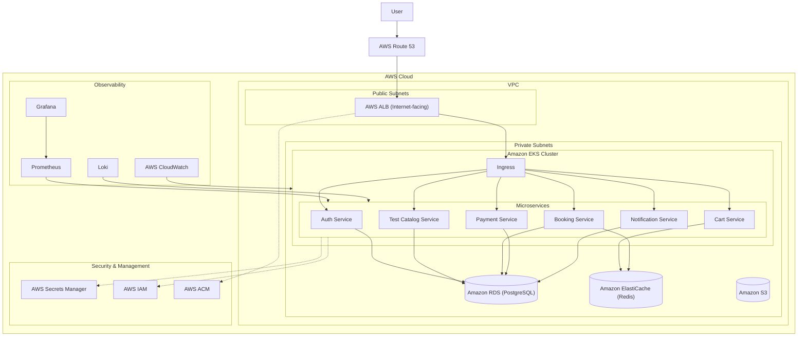
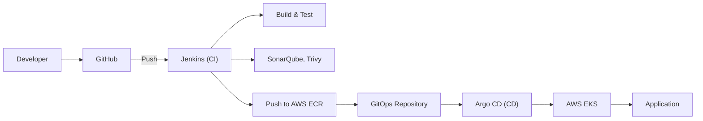

Here is a professional, production-quality `README.md` synthesized from the provided project documentation. It is designed to give a new engineer a complete mental model of the platform, from local development to cloud infrastructure.

---

# Blood Test Booking & Diagnostic E-Commerce Platform

A production-oriented **blood test booking and diagnostic e-commerce platform** built to demonstrate real-world DevOps, AWS, Kubernetes, CI/CD, DevSecOps, and SRE practices. This project is designed to provide a comprehensive, hands-on experience in building and deploying a cloud-native application.

**Current Cloud:** AWS
**Future Cloud:** Azure (documented for future extension)

## 1. Project Overview

This platform provides an end-to-end solution for users to browse and book diagnostic tests and health packages. It is architected as a set of **six core microservices** and features a modern, cloud-native infrastructure.

The primary goal is to build a system that is secure, scalable, and observable. The entire lifecycle—from local development and containerization to CI/CD, infrastructure as code (IaC), and GitOps—is implemented using industry-standard tools and practices.

The project is structured to be both an **educational platform** for a cloud engineer and a **production-ready blueprint** that can be extended and adapted.

## 2. Key Features

### E-commerce & Test Booking
- **Browse & Search Tests:** Explore a catalog of blood tests and diagnostic packages.
- **Cart Management:** Add, remove, and update tests in a shopping cart.
- **Booking Flow:** Complete a booking by providing patient details, selecting a collection method (home or diagnostic center), and choosing an appointment slot.
- **Admin Management:** Create, update, and delete tests in the catalog.

### User & Account Management
- **Registration & Login:** Secure user authentication.
- **User Profile:** Manage personal information.
- **Role-Based Access:** Different permissions for users and administrators.

### Order & Payment
- **Booking & Order History:** View past bookings and order status.
- **Cancellation:** Cancel bookings when necessary.
- **Simulated Payment:** A simulated payment gateway to complete the booking flow.

### Infrastructure & Operations
- **Cloud-Native:** Designed to run on AWS with a focus on scalability and resilience.
- **CI/CD & GitOps:** Automated pipelines for building, testing, and deploying code and infrastructure.
- **Monitoring & Logging:** Comprehensive observability through Prometheus, Grafana, and Loki.
- **Security:** DevSecOps practices integrated throughout the pipeline.
- **Troubleshooting:** Ready-to-use runbooks for common failure scenarios.

## 3. System Overview

The system is comprised of independent microservices that communicate via REST APIs. All services run as containers orchestrated by Kubernetes on AWS EKS.

```
User
  ↓
Route 53 / AWS ALB
  ↓
Kubernetes Ingress
  ↓
Microservices (EKS)
  ├── Auth Service
  ├── Test Catalog Service
  ├── Cart Service
  ├── Booking Service
  ├── Payment Service
  └── Notification Service
  ↓
Data Layer
  ├── PostgreSQL (AWS RDS)
  ├── Redis (Cache/Rate Limiting)
  └── AWS S3 (Storage)
```

## 4. Architecture

### Application Architecture

The platform is built on **six core microservices**:

1.  **Auth Service:** Handles user registration, login, JWT token generation, and role-based access control.
    - *Why:* Centralizes authentication and authorization, improving security and maintainability.
2.  **Test Catalog Service:** Manages the blood test catalog, including details, pricing, and categories. It supports searching and filtering.
    - *Why:* Isolates the product catalog from other business logic, allowing for easy updates.
3.  **Cart Service:** Manages the user's shopping cart, storing temporary data (potentially in Redis) and calculating cart totals.
    - *Why:* Provides a high-performance, temporary state store for user sessions.
4.  **Booking Service:** The core business service. It handles patient details, collection methods, appointment scheduling, booking creation, and history.
    - *Why:* Encapsulates the primary business logic, making it easier to manage complex workflows.
5.  **Payment Service:** Processes payments. Initially implemented as a simulated service to test the flow without a real payment gateway.
    - *Why:* Decouples payment logic, making it easier to integrate a real provider later.
6.  **Notification Service:** Sends notifications (email/SMS) for booking confirmations, payment status, and cancellations.
    - *Why:* Separates communication logic, allowing for integration with various providers without affecting other services.

### Infrastructure Architecture

The infrastructure is designed to be secure, scalable, and resilient.

- **Networking:** Resources are placed in a custom **VPC** with public subnets for internet-facing resources (ALB) and private subnets for backend services (EKS, RDS).
- **Compute:** The application runs on **AWS EKS**, a managed Kubernetes service, ensuring high availability and scalability.
- **Database:** **Amazon RDS for PostgreSQL** is used for transactional data. It is placed in private subnets for security and configured with automated backups.
- **Caching:** **Amazon ElastiCache for Redis** is used for caching, rate limiting, and temporary data (like shopping carts).
- **Storage:** **Amazon S3** is used for storing documents, assets, and static files.
- **Security:** **AWS IAM** enforces least privilege. **AWS Secrets Manager** securely stores database credentials and API keys. **AWS ACM** provides SSL/TLS certificates for HTTPS.

### DevOps Architecture

The CI/CD and GitOps pipelines are fully automated.

- **Source Control:** Git & GitHub.
- **Continuous Integration (CI):** **Jenkins** automates the build, test, and security scanning process.
- **Continuous Delivery (CD):** **Argo CD** implements a GitOps strategy, pulling desired state from a Git repository and reconciling it with the EKS cluster.
- **Infrastructure as Code (IaC):** **Terraform** provisions all AWS resources (VPC, EKS, RDS, IAM, etc.).
- **Observability:** **Prometheus** (metrics), **Grafana** (dashboards), and **Loki** (logs) provide full-stack monitoring and alerting.

## 5. Architecture Diagram



## 6. Technology Stack

| Layer | Technology | Purpose |
| :--- | :--- | :--- |
| **Frontend** | React | User interface and client-side interactions. |
| **Backend** | Python + FastAPI | High-performance, asynchronous API development. |
| **API** | REST | Standardized communication between services and clients. |
| **Database** | PostgreSQL | Primary transactional database for user, booking, and order data. |
| **Managed DB** | AWS RDS PostgreSQL | Managed relational database service, ensuring backups and high availability. |
| **Cache**| Redis | High-performance in-memory data store for caching, rate limiting, and session management. |
| **Object Storage**| AWS S3 | Stores static assets, documents, and images. |
| **Containerization** | Docker | Standardized packaging and distribution of applications. |
| **Local Env.** | Docker Compose | Orchestrates multiple containers for local development. |
| **Source Control** | Git + GitHub | Version control and collaboration. |
| **CI** | Jenkins | Automates build, test, and security stages. |
| **Code Quality** | SonarQube | Continuous code quality and security inspection. |
| **Dep. Security** | OWASP Dependency-Check | Scans for known vulnerabilities in project dependencies. |
| **Image Security** | Trivy | Scans Docker images for vulnerabilities. |
| **Container Registry**| AWS ECR | Private repository for storing and managing Docker images. |
| **IaC** | Terraform | Provisions and manages AWS infrastructure in a declarative way. |
| **Kubernetes** | Kubernetes | Orchestrates and manages containerized applications. |
| **Managed K8s** | AWS EKS | Managed Kubernetes service for easier cluster operations. |
| **Package Management** | Helm | Package manager for Kubernetes, deploying applications as charts. |
| **GitOps** | Argo CD | Automated, pull-based continuous delivery for Kubernetes. |
| **Load Balancer** | AWS ALB | Distributes incoming application traffic across targets (EKS nodes). |
| **DNS** | Route 53 | Domain Name System (DNS) service. |
| **Secrets**| AWS Secrets Manager | Securely stores and manages secrets (DB credentials, API keys). |
| **Metrics** | Prometheus | Collects time-series metrics from Kubernetes and applications. |
| **Dashboards** | Grafana | Visualizes metrics from Prometheus and other data sources. |
| **Logs** | Loki | Aggregates and manages logs from the Kubernetes cluster. |
| **AWS Monitoring** | CloudWatch | Monitoring for AWS resources and application logs. |
| **Scripting** | Bash + Python | Automation scripts for various operational tasks. |
| **Diagrams** | Mermaid | Creates diagrams as code. |

## 7. Repository Structure

```text
blood-test-platform/
├── README.md                     # Main project documentation
├── .gitignore                    # Files/folders to ignore in Git
│
├── services/                     # Backend microservices
│   ├── auth-service/
│   ├── test-catalog-service/
│   ├── cart-service/
│   ├── booking-service/
│   ├── payment-service/
│   └── notification-service/
│
├── frontend/                     # React frontend application
│
├── docker/                       # Docker-related files
│   └── docker-compose.yml        # Orchestration for local development
│
├── helm/                         # Helm charts for Kubernetes deployment
│   └── blood-test-platform/
│       ├── Chart.yaml
│       ├── values.yaml
│       ├── values-dev.yaml
│       ├── values-staging.yaml
│       ├── values-prod.yaml
│       └── templates/
│
├── terraform/                    # Infrastructure as Code
│   ├── modules/                  # Reusable Terraform modules
│   │   ├── vpc/
│   │   ├── iam/
│   │   ├── ecr/
│   │   ├── rds/
│   │   └── eks/
│   └── environments/             # Environment-specific configurations
│       ├── dev/
│       ├── staging/
│       └── prod/
│
├── jenkins/                      # CI/CD pipeline definitions
│   └── Jenkinsfile
│
├── gitops/                       # GitOps configuration for Argo CD
│
├── monitoring/                   # Observability stack configs
│   ├── prometheus/
│   ├── grafana/
│   └── loki/
│
├── tests/                        # Integration, E2E, and load tests
│
├── scripts/                      # Utility scripts for automation
│
└── docs/                         # Project documentation
    ├── architecture.md
    ├── aws-architecture.md
    ├── networking.md
    ├── kubernetes.md
    ├── terraform.md
    ├── cicd.md
    ├── gitops.md
    ├── security.md
    ├── monitoring.md
    ├── logging.md
    ├── troubleshooting.md
    ├── disaster-recovery.md
    ├── cost-optimization.md
    ├── interview-questions.md
    └── future-azure.md
```

### Key Directories Explained

- **`services/`**: Contains the source code for each microservice. Each service has its own `Dockerfile` and `requirements.txt`.
- **`frontend/`**: Holds the React application source code.
- **`terraform/`**: The source of truth for the AWS infrastructure. Includes reusable modules and environment-specific configurations.
- **`helm/`**: Kubernetes deployment manifests packaged as a Helm chart. Includes environment-specific `values.yaml` files.
- **`jenkins/`**: Contains the `Jenkinsfile` which defines the CI pipeline.
- **`gitops/`**: The repository that Argo CD monitors for the desired state of the application.

## 8. Prerequisites

Before setting up the project, ensure you have the following installed and configured on your local machine:

- **Operating System:** Linux (Recommended) or macOS.
- **Runtime & Languages:**
    - Python 3.12+
    - Node.js 18+ & npm/yarn
- **Package Managers:**
    - pip (for Python)
    - npm (for Node.js)
- **Containerization:**
    - Docker Engine (v20.10+)
    - Docker Compose (v2.0+)
- **Cloud Tooling:**
    - AWS CLI (v2) [Configured with appropriate credentials]
    - Terraform (v1.6+)
    - kubectl (v1.28+)
    - Helm (v3+)
- **Development:**
    - Git
    - `tree`, `curl`, `nc` (netcat) for troubleshooting.
- **Accounts & Permissions:**
    - GitHub Account
    - AWS Account (with permissions to create VPC, ECR, RDS, EKS, IAM, and ALB resources).
    - (Optional) A registered domain name for Route 53.

## 9. Installation & Local Setup

Follow these steps to run the application on your local machine using Docker Compose.

**Step 1: Clone the Repository**
```bash
git clone git@github.com:your-username/blood-test-platform.git
cd blood-test-platform
```

**Step 2: Build and Run Services Locally**
Use Docker Compose to build and start all services and their dependencies (PostgreSQL, Redis).
```bash
docker-compose -f docker/docker-compose.yml up --build
```

**Step 3: Verify the Setup**
- **API:** Access the FastAPI service at `http://localhost:8000/tests`.
- **Docs:** Explore the interactive API documentation at `http://localhost:8000/docs`.
- **Health Check:** Verify service health at `http://localhost:8000/health`.

This setup is ideal for development and testing. It does not require an AWS account.

## 10. Environment Configuration

The application uses environment variables for configuration. Below is a general outline of the required variables.

### Application Services (`.env`)
Create a `.env` file in the root of each service or use Docker Compose environment variables.

```env
# Database Configuration
DATABASE_URL=postgresql://<user>:<password>@<host>:<port>/<db_name>
DATABASE_HOST=<rds-endpoint>
DATABASE_PORT=5432
DATABASE_USER=<db_user>
DATABASE_PASSWORD=<db_password>
DATABASE_NAME=<db_name>

# Redis Configuration
REDIS_URL=redis://<redis-host>:6379

# JWT/Auth
SECRET_KEY=<your-secret-key>
ALGORITHM=HS256
ACCESS_TOKEN_EXPIRE_MINUTES=30

# AWS Configuration (for services using AWS services)
AWS_ACCESS_KEY_ID=<your-aws-access-key>
AWS_SECRET_ACCESS_KEY=<your-aws-secret-key>
AWS_REGION=ap-south-1
```

### Infrastructure (Terraform)
For infrastructure provisioning, create a `terraform.tfvars` file in each environment directory (e.g., `terraform/environments/dev/`).

```hcl
aws_region = "ap-south-1"
project_name = "blood-test"
environment = "dev"

# VPC Configuration
vpc_cidr = "10.0.0.0/16"
public_subnet_cidrs = ["10.0.1.0/24", "10.0.2.0/24"]
private_subnet_cidrs = ["10.0.11.0/24", "10.0.12.0/24"]
availability_zones = ["ap-south-1a", "ap-south-1b"]

# RDS Configuration
db_instance_class = "db.t4g.micro"
db_name = "bloodtest_db"
db_username = "app_user"
# db_password will be stored in AWS Secrets Manager or as a sensitive variable

# EKS Configuration
eks_node_instance_type = "t3.medium"
eks_desired_capacity = 2
eks_max_capacity = 4
eks_min_capacity = 1
```

## 11. AWS Infrastructure

The infrastructure is defined and managed using Terraform. The current architecture is AWS-first.

### Network (VPC & Subnets)
- **VPC:** A custom VPC with a CIDR block `10.0.0.0/16`.
- **Public Subnets:** Hosts the AWS Application Load Balancer (ALB), which is internet-facing.
- **Private Subnets:** Hosts all internal resources, including:
    - **EKS Worker Nodes:** The Kubernetes cluster nodes.
    - **RDS (PostgreSQL):** The managed database.
    - **ElastiCache (Redis):** The managed cache service.

### Compute (EKS)
- **Kubernetes Cluster:** An AWS-managed EKS cluster is deployed in private subnets.
- **Node Groups:** Managed node groups handle the EC2 instances.
- **Pods:** The six microservices and the frontend run as pods within the cluster.
- **Ingress:** An Ingress controller routes external traffic from the ALB to the appropriate services.
- **Auto Scaling:** Horizontal Pod Autoscaler (HPA) scales pods based on resource usage.

### Databases & Storage
- **Amazon RDS for PostgreSQL:** A private, fully managed database. Security groups restrict access to only the EKS worker nodes.
- **Amazon ElastiCache for Redis:** Provides caching and temporary storage for high-performance data like user sessions and cart items.
- **Amazon S3:** Used for storing static assets, test documents, and potentially user-uploaded files.

### Security
- **IAM:** Roles and policies provide granular access control to AWS resources. EKS nodes are given minimal permissions.
- **Security Groups:** Act as virtual firewalls to control inbound and outbound traffic.
- **Secrets Manager:** Stores sensitive configuration like database credentials, which are injected into pods securely.
- **VPC:** Isolates all resources from the public internet, with only the ALB having a public endpoint.

## 12. Azure Infrastructure

Azure is currently **documented only**. It is planned as a future extension to demonstrate multi-cloud capabilities.

The design envisions a cloud-agnostic application layer that can be deployed to Azure's AKS.

### Conceptual Azure Mapping

| AWS Service | Future Azure Equivalent |
| :--- | :--- |
| VPC | Azure Virtual Network (VNet) |
| EKS | Azure Kubernetes Service (AKS) |
| ECR | Azure Container Registry (ACR) |
| RDS (PostgreSQL) | Azure Database for PostgreSQL flexible server |
| S3 | Azure Blob Storage |
| IAM | Microsoft Entra ID + Azure RBAC |
| ALB | Azure Application Gateway |
| Route 53 | Azure DNS |
| CloudWatch | Azure Monitor |
| Secrets Manager | Azure Key Vault |

**Current State:** AWS implementation is fully complete. Azure implementation will be a separate phase to be activated later.

## 13. Application Flow

### Blood Test Booking Flow

```text
User selects a test
        ↓
User adds test to cart
        ↓
User proceeds to checkout
        ↓
User enters patient details & selects collection method
        ↓
User selects a date and time slot
        ↓
Application creates a booking
        ↓
User is redirected to payment (simulated)
        ↓
Payment is processed (simulated success/failure)
        ↓
Booking status is updated (confirmed/failed)
        ↓
User receives a confirmation notification (simulated)
```

### E-commerce & Cart Flow

```text
User browses tests
        ↓
User searches/filters tests
        ↓
User views test details
        ↓
User adds a test to cart
        ↓
User updates cart (quantity, remove)
        ↓
User applies (future) promotional codes
        ↓
User proceeds to checkout
```

## 14. API Overview

The application uses a **RESTful API** design. All requests to the API are authenticated using **JWT tokens** obtained from the Auth Service.

### Key Endpoints

| Service | Method | Endpoint | Description |
| :--- | :--- | :--- | :--- |
| **Auth** | POST | `/auth/register` | Register a new user. |
| | POST | `/auth/login` | Log in and receive a JWT token. |
| | GET | `/auth/profile` | Get the current user's profile. |
| **Catalog** | GET | `/tests` | List all tests with pagination and filters. |
| | GET | `/tests/{id}` | Get details for a specific test. |
| | POST | `/admin/tests` | Create a new test (Admin only). |
| **Cart** | GET | `/cart` | Get the current user's cart. |
| | POST | `/cart/items` | Add an item to the cart. |
| | DELETE | `/cart/items/{id}` | Remove an item from the cart. |
| **Booking**| POST | `/bookings` | Create a new booking. |
| | GET | `/bookings` | Get the user's booking history. |
| | GET | `/bookings/{id}` | Get details of a specific booking. |
| | PUT | `/bookings/{id}/cancel` | Cancel a booking. |
| **Payment** | POST | `/payments` | Process a payment for a booking. |
| | GET | `/payments/{id}` | Get payment status. |

**Authentication:** All requests (except `/auth/login` and `/auth/register`) require a valid JWT token in the `Authorization` header: `Authorization: Bearer <token>`.

## 15. Database & Data Model

- **Technology:** PostgreSQL, managed via AWS RDS.
- **Core Entities:**
    - **User:** Stores user credentials and profile information.
    - **Test:** Represents a blood test or diagnostic package with details, price, and category.
    - **Cart:** A temporary store for a user's selected tests. This is primarily stored in Redis for speed and expiration.
    - **Booking:** The primary transactional entity. It links a user, a list of tests, patient details, collection info, appointment time, and payment status.
    - **Order:** The processed result of a completed booking.
- **Relationships:**
    - A `User` has many `Bookings`.
    - A `Booking` has many `Test`s.
    - A `Payment` is associated with a single `Booking`.
- **Migration Strategy:** **Alembic** (or a similar SQLAlchemy migration tool) is used to manage schema changes. Migrations are run as part of the CI/CD deployment process.
- **Seed Data:** Initial data (e.g., test catalog categories and sample tests) is loaded using database seeds or Fixtures.

## 16. Authentication & Authorization

- **Authentication Mechanism:** **JWT (JSON Web Tokens)** with `Bearer` token authentication.
- **User Roles:**
    - **User:** Standard user with permissions to browse, add to cart, create bookings, and view their own history.
    - **Admin:** Has additional permissions to manage the test catalog (CRUD operations on tests).
- **Authorization Model:** Role-Based Access Control (RBAC). Middleware checks the user's role from the decoded JWT token before allowing access to admin endpoints.
- **Token Handling:** Tokens are stateless and have an expiration time. They must be included in the `Authorization` header of all protected requests.

## 17. Payments

- **Payment Provider:** **Simulated Payment Gateway**.
- **Flow:**
    1.  After a booking is created, the client requests `/payments` with the booking ID.
    2.  The Payment Service processes a simulated payment. It randomly returns a `SUCCESS` or `FAILURE` status.
    3.  The result is sent to the Notification Service to alert the user.
    4.  The Booking Service updates the booking status accordingly.
- **Security:** The simulated payment is a placeholder. For production, a real gateway (like Stripe or Razorpay) would be integrated.
- **Future:** Integration with a real payment gateway is planned for Phase 2.

## 18. Testing

The project includes a comprehensive testing strategy to ensure reliability and stability.

- **Unit Tests:** Testing individual components and functions in isolation. Run using `pytest` in the service directories.
- **Integration Tests:** Testing interactions between services, databases, and external APIs.
- **API Tests:** Testing the REST endpoints of each service.
- **End-to-End (E2E) Tests:** Simulate complete user workflows from frontend to backend.

### Running Tests
From the root of a service (e.g., `services/test-catalog-service/`):
```bash
pytest -v
```

> **Note:** Ensure you have set up the `test` environment variables or use an in-memory database for testing.

## 19. Build & Deployment

### CI/CD Pipeline (Jenkins)

The CI pipeline is triggered on every push to the repository and runs the following stages:

1.  **Checkout:** Clones the code from GitHub.
2.  **Install Dependencies:** Installs required Python/NPM packages.
3.  **Unit Tests:** Executes `pytest` to validate application logic.
4.  **Lint:** Checks code style and quality using a tool like `flake8` or `pylint`.
5.  **SonarQube Analysis:** Static code analysis to identify bugs, code smells, and security vulnerabilities.
6.  **Dependency Check:** Uses OWASP Dependency-Check to scan for known vulnerabilities in third-party libraries.
7.  **Docker Build:** Builds a Docker image for the service.
8.  **Trivy Scan:** Scans the built Docker image for vulnerabilities in the base image and application layers.
9.  **Push to ECR:** If all tests and scans pass, the Docker image is tagged and pushed to the AWS ECR repository.

### GitOps Deployment (Argo CD)

Deployment is managed via a **GitOps** strategy.

1.  After the CI pipeline pushes a new image to ECR, the image tag is updated in the **GitOps repository**.
2.  **Argo CD** continuously monitors this repository.
3.  Upon detecting a change, Argo CD automatically synchronizes the desired state to the **EKS cluster** by deploying/updating the Kubernetes resources (Deployments, Services, ConfigMaps, etc.) defined in the Helm chart.

### Deployment Process

```text
Developer pushes code
        ↓
Jenkins builds & tests (CI)
        ↓
Image is pushed to ECR
        ↓
Image tag is updated in GitOps repo
        ↓
Argo CD detects drift
        ↓
Argo CD deploys the new image to EKS (CD)
        ↓
Application is live
```

## 20. CI/CD Pipeline



## 21. Monitoring & Logging

### Monitoring (Metrics)
- **Prometheus:** Collects metrics from the application (via the FastAPI Prometheus middleware) and from the Kubernetes cluster (node/pod health).
- **Grafana:** Provides rich, customizable dashboards for visualizing application and infrastructure performance (e.g., request latency, error rates, CPU/memory usage).
- **Alerts:** Prometheus Alertmanager is configured to send notifications (Slack, Email) for critical conditions (e.g., high error rate, service down, high latency).

### Logging
- **Loki:** Aggregates logs from all application pods and system components within the EKS cluster.
- **CloudWatch:** AWS CloudWatch also captures logs from the EKS control plane and other AWS resources.
- **Investigations:** When an issue occurs, engineers should first consult the Grafana dashboards for metrics and then dive into Loki for detailed application logs.

## 22. Security

- **Network Security:**
    - **VPC:** Isolates resources in a private network. The database and application backend are not directly exposed to the internet.
    - **Security Groups:** Strictly limit inbound/outbound traffic to only what is necessary (e.g., allowing port 5432 from the EKS security group to RDS).
- **Authentication & Authorization:**
    - **IAM:** Enforces least privilege for all AWS services and human users.
    - **JWT:** Provides stateless authentication for application users.
- **Secrets Management:**
    - **AWS Secrets Manager:** Stores database credentials, API keys, and other sensitive information. These are injected into Kubernetes pods at runtime.
- **Image & Code Security:**
    - **Trivy:** Scans Docker images for vulnerabilities before they are pushed to ECR.
    - **SonarQube:** Scans code for security vulnerabilities and "code smells" during the CI pipeline.
    - **OWASP Dependency-Check:** Identifies vulnerabilities in open-source dependencies.
- **Encryption:**
    - **In Transit:** HTTPS is enforced via the AWS ALB and ACM, securing communication between the client and the server.
    - **At Rest:** RDS and S3 are configured with encryption at rest.

## 23. Troubleshooting

### Problem: Application Pod in CrashLoopBackOff
- **Possible Cause:** Application failing to start due to a configuration error, missing environment variable, or database connection failure.
- **Solution:**
    1.  Describe the pod: `kubectl describe pod <pod-name> -n <namespace>`.
    2.  Check logs: `kubectl logs <pod-name> -n <namespace>`.
    3.  Check if the database is accessible from within the cluster.

### Problem: ImagePullBackOff
- **Possible Cause:** ECR repository does not exist, the image tag is incorrect, or the node's IAM role doesn't have permissions to pull from ECR.
- **Solution:**
    1.  Verify the image name and tag in the deployment manifest.
    2.  Check the ECR repository to ensure the image exists.
    3.  Verify the IAM role attached to the EKS node has the `AmazonEC2ContainerRegistryReadOnly` policy.

### Problem: Service Not Reachable via ALB
- **Possible Cause:** Ingress misconfiguration, ALB target group not healthy, or incorrect service port.
- **Solution:**
    1.  Check Ingress resource: `kubectl describe ingress <ingress-name>`.
    2.  Check ALB target group health in the AWS Console.
    3.  Verify the service is running and exposing the correct port: `kubectl get svc`.

### Problem: Terraform Apply Fails
- **Possible Cause:** AWS authentication failure, missing permissions, or a resource naming conflict.
- **Solution:**
    1.  Verify AWS credentials: `aws sts get-caller-identity`.
    2.  Review the error message for specific resource conflicts. The error often points to the exact issue.

## 24. Common Developer Tasks

- **Starting the Application Locally:** `docker-compose -f docker/docker-compose.yml up`
- **Running Tests:** `pytest -v` in the specific service directory.
- **Creating a Database Migration:** Use the service's migration tool (e.g., `alembic revision --autogenerate -m "message"`).
- **Updating Environment Variables:** Update the `.env` file and restart the service. For infrastructure, update `terraform.tfvars`.
- **Deploying a New Version:** Push code to GitHub. The CI/CD pipeline handles the rest.
- **Checking Logs in Kubernetes:** `kubectl logs <pod-name> -n <namespace> -f`.

## 25. Operational Runbook

### Deployment
1.  Ensure the CI pipeline (Jenkins) has successfully built and pushed the new image.
2.  Update the image tag in the GitOps repository.
3.  Argo CD will automatically sync the change to the EKS cluster.
4.  Monitor the deployment in Argo CD and via `kubectl rollout status deployment/<deployment-name>`.
5.  After deployment, check the Grafana dashboard for any increased error rates or latency.

### Rollback
1.  Revert the image tag in the GitOps repository to the previous stable version.
2.  Commit the change.
3.  Argo CD will automatically roll back the deployment.
4.  Alternatively, use `kubectl rollout undo deployment/<deployment-name>`.

### Scaling
- **Horizontal Pod Autoscaling (HPA):** In most cases, HPA will manage scaling based on CPU/memory metrics. Manually scale by editing the replica count in the GitOps repository.

### Database Operations
- **Backup:** AWS RDS automatically manages daily snapshots.
- **Restore:** Initiate a restore from the RDS Console or CLI using a snapshot.

### Investigating an Incident
1.  **Check Metrics:** Look at Grafana dashboards for resource usage, error rates, and latency.
2.  **Check Logs:** Use Loki to search for error patterns.
3.  **Check Infrastructure:** Use `kubectl` to check pod statuses, events, and descriptions.
4.  **Check AWS:** Look at CloudWatch, RDS metrics, and ALB health.

## 26. Important Design Decisions

### Shared Database vs Database-per-Service
- **Decision:** Initially, use a shared PostgreSQL instance for all services.
- **Reason:** For a learning project and early production stages, a single database reduces operational complexity, cost, and setup time. It also makes it easier to manage migrations in a monolithic repository.
- **Impact:** This decision simplifies local development (Docker Compose) and early AWS setup. However, it creates a data coupling between services. A migration to database-per-service is a planned future evolution for scaling and team autonomy.

### Monorepo
- **Decision:** Use a single Git repository (monorepo) for all services, frontend, and infrastructure code.
- **Reason:** Facilitates understanding the complete system relationship, simplifies versioning, and makes it easier for a single developer/team to coordinate changes.
- **Impact:** Monorepos can become large and complex over time. For a project of this scope, it is a good architectural fit.

### GitOps for Deployment
- **Decision:** Use Argo CD to implement a GitOps strategy for CD.
- **Reason:** Provides a single source of truth (the Git repository) for the desired state of the application in Kubernetes. It enables automated reconciliation, drift detection, and easy rollbacks.
- **Impact:** Significantly improves deployment reliability and auditability. It separates the CI (build/test) responsibility from CD (deploy) responsibility.

### Simulated Payment
- **Decision:** Use a simulated payment gateway.
- **Reason:** Avoids the complexity, regulatory concerns (PCI compliance), and cost of integrating a real gateway during the foundational development phase.
- **Impact:** Allows the complete booking flow to be tested and demonstrated without financial dependencies. A real gateway can be plugged in later as a drop-in replacement.

## 27. Known Limitations

- **Simulated Payment:** The payment service uses a simulated success/failure response. It does not process real financial transactions.
- **Single Database:** All microservices share a single PostgreSQL instance. This violates the database-per-service pattern and creates a potential point of failure and performance bottleneck.
- **No Email/SMS Provider:** The Notification Service logs events to the console rather than sending actual emails or SMS messages.
- **Azure Inactive:** The Azure infrastructure is documented but not implemented. The application is not currently deployed to Azure.
- **Advanced Security:** The application does not implement advanced security measures like WAF (Web Application Firewall) or extensive DDoS protection.

## 28. Development Guidelines

### Git Branching Strategy
- `main`: The primary, production-ready branch. Code is merged here after passing all CI checks and reviews.
- `develop`: The branch for integrating features before they are merged to `main`.
- `feature/*`: Branches for new features or bug fixes, branched from `develop`.

### Commit Conventions
Use the [Conventional Commits](https://www.conventionalcommits.org/) specification:
- `feat:` A new feature.
- `fix:` A bug fix.
- `docs:` Documentation changes.
- `style:` Code style changes (formatting, missing semicolons, etc.).
- `refactor:` Code refactoring without changing functionality.
- `test:` Adding or updating tests.
- `chore:` Routine tasks (e.g., dependency updates, build process changes).

### Pull Request (PR) Process
1.  Create a feature branch from `develop`.
2.  Make changes, commit with conventional commit messages.
3.  Push the branch and open a Pull Request to `develop`.
4.  Ensure all CI checks (tests, lints, scans) pass.
5.  Request a review from at least one other developer.
6.  After approval, merge the PR.

## 29. FAQ

**Q: How do I get access to the AWS Console?**
A: AWS access is managed via IAM. Contact the project lead to have a user account created for you with the appropriate permissions.

**Q: How do I run a single service locally instead of the entire stack?**
A: You can run a service individually by navigating to its directory, activating its virtual environment, and running `uvicorn app:app --reload`.

**Q: How do I connect to the RDS database?**
A: RDS is not exposed to the internet. To connect, you must SSH into a bastion host or use port-forwarding from a Kubernetes pod that is within the VPC.

**Q: The Jenkins build is failing. Where can I find the logs?**
A: Logs for the Jenkins build are available directly in the Jenkins UI. Additionally, the SonarQube and Trivy scan results are published as artifacts for each build.

## 30. Documentation Map

| Topic | Documentation File |
| :--- | :--- |
| Architecture Overview | `docs/architecture.md` |
| AWS Architecture & Setup | `docs/aws-architecture.md`, `docs/networking.md` |
| Kubernetes & EKS | `docs/kubernetes.md` |
| Terraform & IaC | `docs/terraform.md` |
| CI/CD & Jenkins | `docs/cicd.md` |
| GitOps & Argo CD | `docs/gitops.md` |
| Security | `docs/security.md` |
| Monitoring & Logging | `docs/monitoring.md`, `docs/logging.md` |
| Troubleshooting | `docs/troubleshooting.md` |
| Disaster Recovery | `docs/disaster-recovery.md` |
| Cost Optimization | `docs/cost-optimization.md` |
| Future Azure Plans | `docs/future-azure.md` |
| Interview Preparation | `docs/interview-questions.md` |

## 31. Onboarding Checklist

- [ ] Read the entire README and understand the system overview.
- [ ] Set up your development environment (Git, Python, Node.js, Docker, etc.).
- [ ] Clone the repository.
- [ ] Run the application locally using Docker Compose.
- [ ] Run the unit/integration tests.
- [ ] Request access to AWS and verify your CLI is configured (`aws sts get-caller-identity`).
- [ ] Familiarize yourself with the Terraform directory structure.
- [ ] Familiarize yourself with the Helm chart structure.
- [ ] Create your first feature branch and make a small code change.
- [ ] Open a Pull Request and follow the PR process.
- [ ] Schedule a session with a team member to review the CI/CD pipeline.
- [ ] Practice explaining the architecture and your role in an interview setting.
